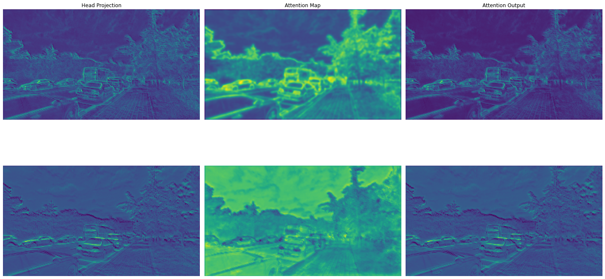
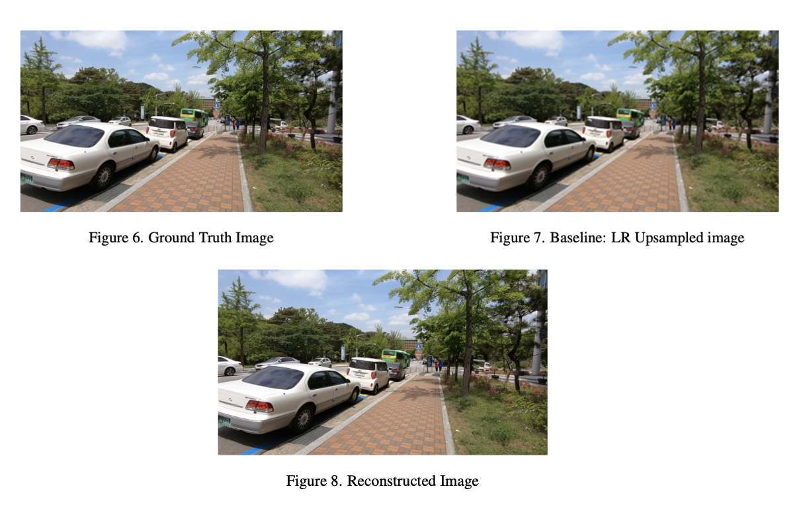

# Attention-based Fusion for Video Super-Resolution

This is the course project for 6.8300 Advances in Computer Vision. The course is taught by Professors [William T. Freeman](https://scholar.google.com/citations?user=0zZnyMEAAAAJ&hl=en&oi=ao), [Vincent Sitzmann](https://scholar.google.com/citations?user=X44QVV4AAAAJ&hl=en&oi=ao) and [Mina Konaković Luković](https://scholar.google.com/citations?user=32Q2ni8AAAAJ&hl=en&oi=ao).

Vassili Chesterkine, Paul Theron

---

Report is available [here](./report.pdf).

## Project Description

Video Super-Resolution (VSR) is the process of enhancing low-resolution videos to high-resolution equivalents. Compared to Image Super-Resolution, these methods capitalize on neighboring frame alignment to extract additional information. Traditional state-of-the-art methods, while powerful, rely on high computational resources, making them less viable for resource-constrained environments.

This project presents a novel, resource-efficient approach to VSR. Our methodology uses a hierarchical system to incorporate temporal information, using a reduced number of frames but still maintaining substantial performance. This is achieved by partitioning the input sequence into distinct frame rate groups, each offering complementary information to recover missing details in the reference frame.

## Method

Our approach leverages BasicVSR for feature extraction and alignment, which is the core of our model. The input sequences are partitioned into distinct frame rate groups, effectively utilizing the temporal information hierarchically.

The key innovation of our method lies in an inter-group attention-based module, which we use to integrate information from the different frame rate groups. This module enables efficient and accurate recovery of missing details in the reference frame, making our approach superior in terms of both performance and computational efficiency.

## Main Results

The results from our project can be summarized in the table below:
|   Method   |       Modality      |   Params  |     PSNR     |
|:----------:|:-------------------:|:---------:|:------------:|
|            |                     |    (M)    |              |
|   Bicubic  |          --         |     --    |  26.14 |
|            |       5 frames      | 6.3 |  30.56 |
|  BasicVSR  |       7 frames      | 6.3 |  30.65 |
|            |      11 frames      | 6.3 |  30.92 |
|   IconVSR  |       5 frames      | 8.7 |  30.81 |
|            |     Single Head     | 6.8 |  30.74 |
| Our Method |      Multi Head     | 7.7 |  30.67 |
|            | Frame rates (1,3,5) | 6.6 |  30.65 |

Our proposed method not only demonstrates competitive performance against state-of-the-art models but also showcases potential for further refinement and optimization. One should note that all of our experiments were performed with relatively limited computational infrastructure. Read more in the [final report](./report.pdf).

### Figures
The images below showcase the outputs obtained by 2 distinct attention heads. Notably, the first (top) focuses on finer details of the frames, while the second (bottom) blurs out the latter and provides a depth map of the frame. This suggests that during training, the different attention heads learn to focus on specific parts of the input, thereby providing a finer reconstruction.


Below is the final reconstruction of the reference frame using the attention maps from the multi-head attention module:



## Repository Usage
### Data

We will use the REDS dataset, available here:
https://seungjunnah.github.io/Datasets/reds.html

To download the dataset, run the following command in the terminal:

```bash
bash data/download_data.sh
bash data/unzip_data.sh
```

### Installation

To create the environment, run the following command in the terminal:

```bash

conda create -n computer_vision python=3.9

conda activate computer_vision
```

To install the required packages, run the following command

```bash
pip install -r requirements.txt
```

### Usage

To train an instance of our model, run the following command in the terminal:

```bash
python src/train_multistage_bvsr.py -v -c config_mstagebvsr_final_1.cfg
```

All the hyperparameters are specified in the config file. The `-v` flag enables verbose mode, which prints the training progress to the terminal.
